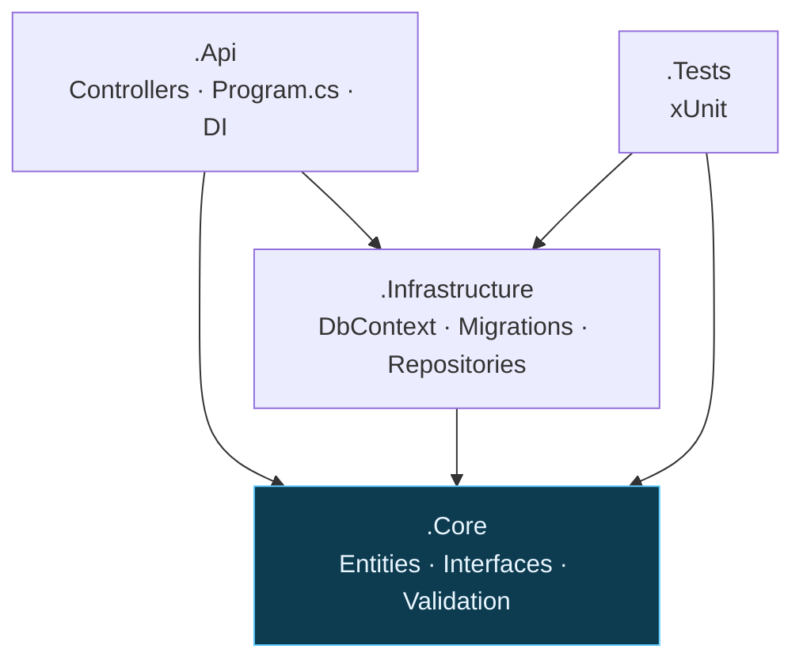
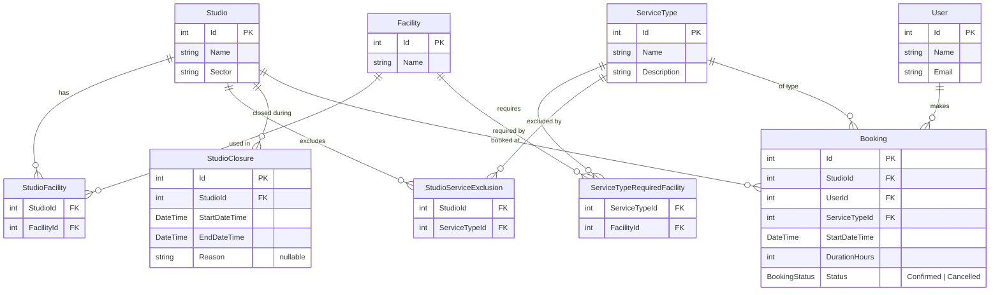

# RecordingStudio.BookingEngine


Booking backend for recording-studio sessions. A client picks a studio, a day, a start time, a duration and a service type; the engine validates the request against the studio's schedule and availability.

It's a single ASP.NET Core application split into four projects, so the booking logic stays independent of the web and database layers. Stack: .NET 10 / C#, EF Core (SQLite for local dev, SQL Server as the production target), SignalR for live slot updates, a minimal Blazor frontend, and xUnit for tests.

## Architecture



Dependencies point inward: `Api → Infrastructure → Core`, plus `Api → Core`. `Core` references nothing, so the validation logic is unit-testable without a database. Data access is inverted — `Core` defines the interfaces (e.g. `IBookingRepository`), `Infrastructure` implements them with EF Core.

## Database schema



## Booking rules

The core of the project. A booking is validated against six rules:

1. **Start time** must fall on a 30-minute boundary — `14:00`, `14:30`, `15:00`, and so on.
2. **Duration** is at least 2 hours, in whole-hour steps. It's an `int`, so fractional durations can't even be expressed.
3. **A 30-minute buffer** is required between two consecutive bookings at the same studio (logistics, sound engineer). Overlap checks inflate every existing booking by 30 minutes on each side.
4. **Services are derived from facilities**, not toggled by hand. A studio offers a service if it has all the required facilities *and* the service isn't in its manual exclusion list.
5. **Closures span a start/end interval** rather than whole days, which also covers the all-day case when needed.
6. **A closure cancels overlapping bookings** — when an admin closes a studio over an interval that hits confirmed bookings, those move to `Cancelled`. Contacting the client stays a manual task.

## API

| Method | Route | Purpose |
| ------ | ----- | ------- |
| `GET`  | `/api/studios` | List studios |
| `GET`  | `/api/studios/{id}/services` | Services the studio can offer (rule 4, computed) |
| `GET`  | `/api/bookings/studio/{id}` | Confirmed bookings for a studio |
| `POST` | `/api/bookings/validate` | Check a booking against every rule without saving |
| `POST` | `/api/bookings` | Create a booking (validated, then persisted) |
| `POST` | `/api/closures` | Register a closure; auto-cancels overlapping bookings (rule 6) |

## Web UI

A minimal Blazor (interactive server) page at `/` lets a client pick a studio, see only the services it offers, choose a slot and book. A SignalR hub (`/hubs/booking`) pushes booking changes so open pages refresh live — book in one tab and a second tab updates on its own.

## Layout

```
RecordingStudio.BookingEngine.Api/              → Controllers, Blazor UI, SignalR hub, Program.cs
RecordingStudio.BookingEngine.Core/             → Entities, Interfaces, Services (business logic)
RecordingStudio.BookingEngine.Infrastructure/   → DbContext, Repositories (data access)
RecordingStudio.BookingEngine.Tests/            → Unit tests (booking validation)
```

## Running it

```bash
dotnet build
dotnet ef database update -p RecordingStudio.BookingEngine.Infrastructure -s RecordingStudio.BookingEngine.Api
dotnet run --project RecordingStudio.BookingEngine.Api --launch-profile http
dotnet test
```

Then open **http://localhost:5237** for the booking UI. Open it in two tabs to watch SignalR update one when you book in the other.

The migration step creates the local SQLite database (seeded with two studios, some facilities and services). Moving to SQL Server means swapping the EF Core provider package, the `UseSqlite` call and the connection string — nothing else changes.

## Status

- [x] Architecture & schema
- [x] Solution + 4 projects
- [x] Core entities
- [x] DbContext + EF Core migrations
- [x] Pure validation rules + unit tests
- [x] Repositories
- [x] Data-dependent validation rules (all 6 rules)
- [x] API endpoints
- [x] Blazor frontend
- [x] SignalR live updates
