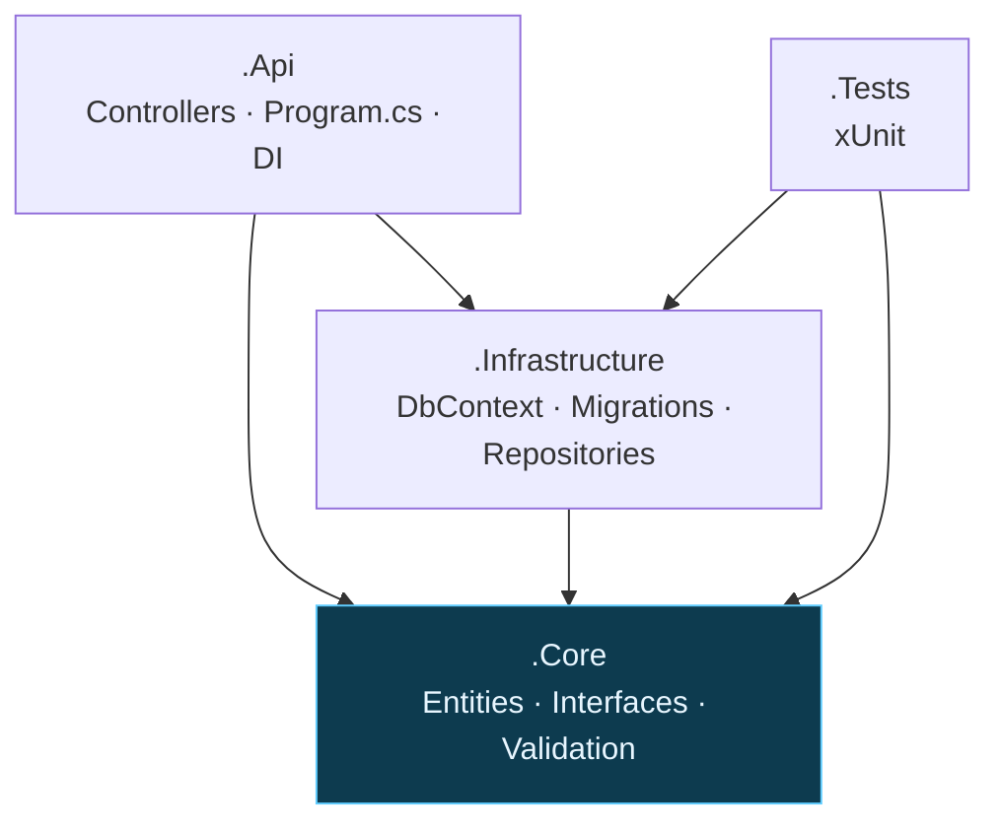
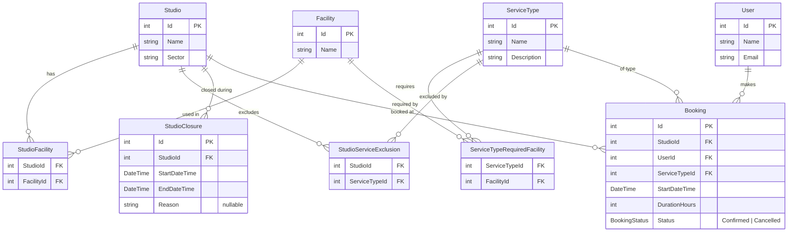

# RecordingStudio.BookingEngine


**Booking backend for recording-studio sessions.** A client picks a studio, a day, a start time, a
duration and a service type. The engine checks that request against the studio's schedule, the
facilities that studio has, and everything already on the calendar.

One ASP.NET Core application in four projects, so the booking rules stay clear of the web and
database layers. .NET 10 and C#, EF Core over SQLite locally with SQL Server as the production
target, SignalR for live slot updates, a small Blazor frontend, xUnit for the tests.

## Architecture


```mermaid
graph TD
    Api[".Api<br/>Controllers · Program.cs · DI"]
    Infra[".Infrastructure<br/>DbContext · Migrations · Repositories"]
    Core[".Core<br/>Entities · Interfaces · Validation"]
    Tests[".Tests<br/>xUnit"]

    Api --> Infra
    Api --> Core
    Infra --> Core
    Tests --> Core
    Tests --> Infra

    classDef core fill:#0d3b4f,stroke:#60cdff,color:#e8f6ff;
    class Core core;
```

Dependencies point inward: `Api → Infrastructure → Core`, plus `Api → Core`. I kept `Core`
referencing nothing at all, so the validation logic is unit-testable with no database in the way.
Data access is inverted the same way: `Core` declares the interfaces it needs, `IBookingRepository`
among them, and `Infrastructure` implements them with EF Core.

## Database schema


```mermaid
erDiagram
    Studio ||--o{ StudioFacility : has
    Facility ||--o{ StudioFacility : "used in"
    ServiceType ||--o{ ServiceTypeRequiredFacility : requires
    Facility ||--o{ ServiceTypeRequiredFacility : "required by"
    Studio ||--o{ StudioServiceExclusion : excludes
    ServiceType ||--o{ StudioServiceExclusion : "excluded by"
    Studio ||--o{ StudioClosure : "closed during"
    Studio ||--o{ Booking : "booked at"
    User ||--o{ Booking : makes
    ServiceType ||--o{ Booking : "of type"

    Studio {
        int Id PK
        string Name
        string Sector
    }
    Facility {
        int Id PK
        string Name
    }
    ServiceType {
        int Id PK
        string Name
        string Description
    }
    User {
        int Id PK
        string Name
        string Email
    }
    StudioFacility {
        int StudioId FK
        int FacilityId FK
    }
    ServiceTypeRequiredFacility {
        int ServiceTypeId FK
        int FacilityId FK
    }
    StudioServiceExclusion {
        int StudioId FK
        int ServiceTypeId FK
    }
    StudioClosure {
        int Id PK
        int StudioId FK
        DateTime StartDateTime
        DateTime EndDateTime
        string Reason "nullable"
    }
    Booking {
        int Id PK
        int StudioId FK
        int UserId FK
        int ServiceTypeId FK
        DateTime StartDateTime
        int DurationHours
        BookingStatus Status "Confirmed | Cancelled"
    }
```

## Booking rules

A booking has to clear six rules before anything is written:

1. **Start time** falls on a 30-minute boundary. `14:00`, `14:30`, `15:00`, and so on.
2. **Duration** is at least 2 hours, in whole-hour steps. I made the field an `int`, so a fractional
   duration cannot even be expressed.
3. **A 30-minute buffer** sits between two consecutive bookings at the same studio. I put it there
   for logistics and for the sound engineer, and the overlap checks pay for it by inflating every
   existing booking by 30 minutes on each side.
4. **Services are derived from facilities.** A studio offers a service when it has every facility
   that service requires, and when the service is absent from its exclusion list, which is the only
   part an admin sets by hand.
5. **Closures span a start and an end datetime**, so an afternoon off and a whole week both use the
   same shape.
6. **A closure cancels overlapping bookings.** When an admin closes a studio over an interval that
   catches confirmed bookings, those move to `Cancelled`, though telling the client is still a
   manual step.

## API

| Method | Route | Purpose |
| ------ | ----- | ------- |
| `GET`  | `/api/studios` | List studios |
| `GET`  | `/api/studios/{id}/services` | Services the studio can offer (rule 4, computed) |
| `GET`  | `/api/bookings/studio/{id}` | Confirmed bookings for a studio |
| `POST` | `/api/bookings/validate` | Check a booking against every rule without saving |
| `POST` | `/api/bookings` | Create a booking (validated, then persisted) |
| `POST` | `/api/closures` | Register a closure, auto-cancelling overlapping bookings (rule 6) |

## Web UI

A minimal Blazor page at `/`, interactive server mode, lets a client pick a studio, see only the
services that studio can offer, choose a slot and book. A SignalR hub at `/hubs/booking` pushes
booking changes out to open pages. Book in one tab and a second tab updates on its own.

## Layout

```
RecordingStudio.BookingEngine.Api/              → Controllers, Blazor UI, SignalR hub, Program.cs
RecordingStudio.BookingEngine.Core/             → Entities, Interfaces, Services (business logic)
RecordingStudio.BookingEngine.Infrastructure/   → DbContext, Repositories (data access)
RecordingStudio.BookingEngine.Tests/            → Unit tests (booking validation)
```

## Running it

```bash
dotnet build
dotnet ef database update -p RecordingStudio.BookingEngine.Infrastructure -s RecordingStudio.BookingEngine.Api
dotnet run --project RecordingStudio.BookingEngine.Api --launch-profile http
dotnet test
```

Then open **http://localhost:5237**. Open it in two tabs to watch SignalR update one while you book
in the other.

The migration step creates the local SQLite database, seeded with two studios and a handful of
facilities and services. Three things change when this moves to SQL Server: the EF Core provider
package, the `UseSqlite` call and the connection string.

## Status

- [x] Architecture & schema
- [x] Solution + 4 projects
- [x] Core entities
- [x] DbContext + EF Core migrations
- [x] Pure validation rules + unit tests
- [x] Repositories
- [x] Data-dependent validation rules (all 6 rules)
- [x] API endpoints
- [x] Blazor frontend
- [x] SignalR live updates

---

Built as a portfolio project, to have somewhere real to put schedule validation. The six rules live
in `RecordingStudio.BookingEngine.Core`, where the unit tests reach them without a database being
involved, and that is the whole reason the solution is split the way it is.
